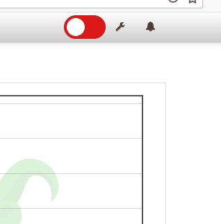

# OctoPrint PowerButton Plugin

**NOTE: This plugin requires special hardware to work. See Hardware section below.**

Turn the printer power on and off remotely from OctoPrint Web interface.

### Features:
- Turn the printer on and off through a toggle button added to the Web interface.
  
- Lock on print - the button gets locked when a print is in progress, to prevent the user from
  accidently turning the printer off.
  
- Auto-off - The printer is turned off automatically after the print has finished successfully
  (and a user-defined delay).
  
- Auto-connect - Try to connect to the printer automatically after it has been turned on.
- Physical interface - The plugin supports a physical button to turn the printer on and off, and
  LEDs to show its current status.

## Setup

Install via the bundled [Plugin Manager](https://github.com/foosel/OctoPrint/wiki/Plugin:-Plugin-Manager)
or manually using this URL:

    https://github.com/avishorp/OctoPrint-PowerButton/archive/master.zip

## Configuration

**TODO:** Describe your plugin's configuration options (if any).
