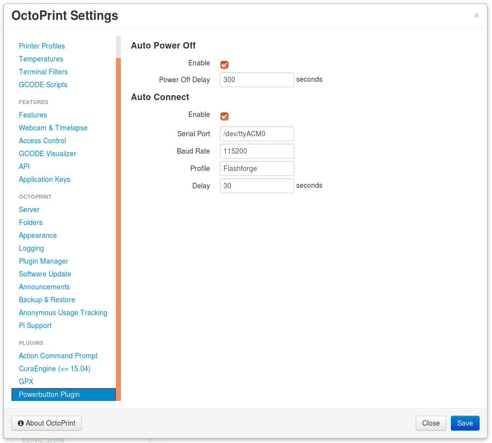

# OctoPrint PowerButton Plugin

**NOTE: This plugin requires special hardware to work. See Hardware section below.**

Turn the printer power on and off remotely from OctoPrint Web interface.

### Features:
- Turn the printer on and off through a toggle button added to the Web interface.
  
- Lock on print - the button gets locked when a print is in progress, to prevent the user from
  accidently turning the printer off.
  
- Auto-off - The printer is turned off automatically after the print has finished successfully
  (and a user-defined delay).
  
- Auto-connect - Try to connect to the printer automatically after it has been turned on.
- Physical interface - The plugin supports a physical button to turn the printer on and off, and
  LEDs to show its current status.

## Setup

Install via the bundled [Plugin Manager](https://github.com/foosel/OctoPrint/wiki/Plugin:-Plugin-Manager)
or manually using this URL:

    https://github.com/avishorp/OctoPrint-PowerButton/archive/master.zip

## Configuration

### Auto Power Off
Enable or disable the auto power-off feature by clicking the checkbox. The "Power Off Delay" field determines
the number of seconds to wait until the printer is powered off. During this time, a user can click on the
power button in the user interface to cancel the scheduled power-off.

### Auto Connect
Enable or disable the auto-connect feature by clicking the checkbox. The Port, Baud rate and Profile fields
determine the settings with which the printer will be connected. If any of those fields are left blank, AUTO
setting will be used in for that field. The delay field sets the time the plugin waits before it tries to
connect. This delay can be used to allow the printer to boot up and settle.

## Hardware

----------------------- ------------------------------------
    Never connect loads such as a relay or a LED directly to a Raspberry Pi pin. Always use
                        an appropriate driver circuit.

----------------------------------------------------------------

The plugin is designed to be run on a Raspberry Pi. The Raspberry Pi connects to a relay and optionally a button 
and a pair of LEDs via its GPIO pins. The default pin configuration is:

| GPIO  | Name       | Polarity(*) | Description                              | Cfg. Entry   |
|-------|------------|-------------|------------------------------------------|--------------|
| 17    | RELAY      | Positive    | Printer power relay                      | gpio_relay   |
| 22    | BUTTON     | Negative    | Physical power on/off button (momentary) | gpio_button  |
| 3     | LED_RED    | Positive    | Red LED                                  | gpio_red     |
| 2     | LED_GREEN  | Positive    | Green LED                                | gpio_green   |

(*) **Polarity**: Positive = Asserted (Turned on/button pressed) when logic '1'

The default pin assignments can be altered by manually adding entries to the OctoPrint configuration
file (under the `plugins/powerbutton` section). The name corresponding to each of the connections appears
in the table above. The polarity of the signals can also be changed with the `realy_polarity`, `button_polarity`
and `led_polarity` entries which apply to the relay, the button and both of the LEDs correspondingly.

